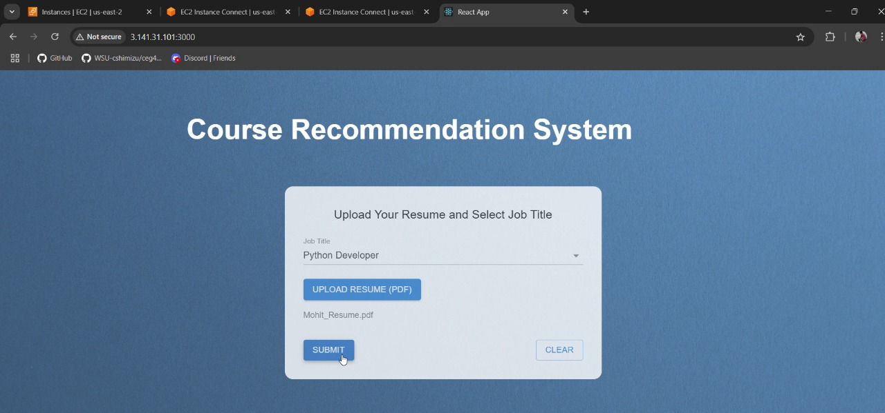
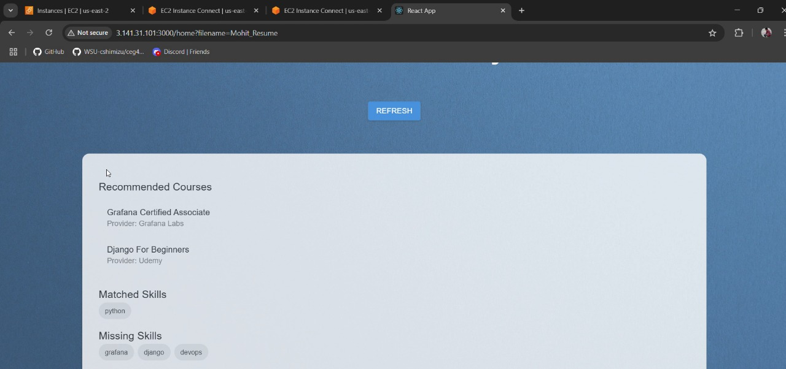

# 🎓 Course Recommendation System Using AI

An intelligent resume-based course recommendation engine that analyzes your uploaded resume, compares your skills with job-specific requirements, and suggests relevant online courses using AWS services and Python automation.

---

## 🚀 Features

- 📄 Resume Upload (PDF/TXT)
- 🧠 Skill Extraction from resume text
- 🧑‍💼 Job Title-based Skill Matching
- 📚 Course Recommendations from DynamoDB
- ☁️ AWS Integration with Lambda, S3, and API Gateway

---

## 🛠️ Tech Stack

| Component     | Technology                |
|---------------|---------------------------|
| Frontend      | ReactJS                   |
| Backend       | Flask (Python)            |
| AI/API        |  RapidAPI                 |
| Database      | AWS DynamoDB              |
| File Storage  | AWS S3 

## ⚙️ How It Works

1. User uploads resume from the frontend
2. Resume is stored in AWS S3 bucket (`code-input`)
3. Lambda function extracts resume text & skills
4. Another Lambda uses job title to fetch relevant job skills
5. `analyze_skills.py` compares both skill sets
6. Missing skills are matched to available courses in DynamoDB
7. Result is stored in `course-recommendations/` and shown on frontend

---

## 📸 Screenshots

### 🔹 Home Page

### 🔹 Recommendation Display

## 👥 Project Members

- **Sachin Patel**  
  🎓 Major: Computer Science  
  📅 Year: Senior  
  🌍
- **Abhik Ashwinkumar Patel**  
  🎓 Major: Computer Science  
  📅 Year: Senior  

- **Dhruv Alpeshkumar Patel**  
  🎓 Major: Computer Science  
  📅 Year: Senior  

